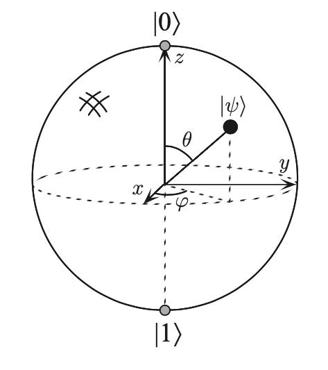

# Basic Definition in Quantum Computing

## Qubit

A vector $a \mathinner{|0\rangle} + b \mathinner{|1\rangle}$, $|a|^2 + |b|^2 = 1$, in which

$$
\mathinner{|0\rangle} = \begin{pmatrix}1\\0\end{pmatrix},
\mathinner{|1\rangle} = \begin{pmatrix}0\\1\end{pmatrix}
$$

## Classical Gate

AND, OR, NOT, NAND...

Call a set of gates **universal** if it can compute any $f:\{0, 1\}^n \rightarrow \{0, 1\}$.

Ex. {AND, OR, NOT}, {NAND}

NAND 能够实现 NOT、AND ，OR 能被 NOT、AND 实现。则 {NAND} is universal.

## Reversible Computing

AND gate is not reversible. Cannot recover (x,y) pairs with the output f(x, y).

Toffoli gate is reversible and universal:

(x, y, z) -> (x, y, (x AND y)$\oplus$ z)

By reversible circuit:

Input: $(x_1, \cdots, x_n)$.

Output: $(y_1, \cdots, y_m)$.

Junk: $(j_1, \cdots, j_k)$.

右图将输出复制，再将进行 C 的逆运算，最后仅获得输入和输出，去掉 Junk 部分。

Whenever we compute $x \to f(x)$ efficiently, we can efficiently reversibly compute:

$$
(x, y, 0) \to (x, y \oplus f(x), 0)
$$

## Postulates in quantum computing

### Quantum States

Qubit: $\begin{pmatrix}a_0 \\ a_1\end{pmatrix}, a_0, a_1 \in \mathbb{C}$, called "amplitude", satisfy $|a_0|^2 + |a_1|^2 = 1$

Basic vectors: $\mathinner{|0\rangle} = \begin{pmatrix}1\\0\end{pmatrix},\mathinner{|1\rangle} = \begin{pmatrix}0\\1\end{pmatrix}$

Call them **a computational basis** for a qubit. Ex. $\mathinner{|\varphi\rangle} = a_0 \mathinner{|0\rangle} + a_1 \mathinner{|1\rangle}$. "**ket**"

**Dual vector** 共轭转置 $\mathinner{\langle\varphi|} = a_0^*\mathinner{\langle0|} + a_1^*\mathinner{\langle1|}$. "**bra**"

**Inner product**

$\mathinner{\langle\phi|}\mathinner{|\varphi\rangle} = \mathinner{\langle\phi|\varphi\rangle}$

$\mathinner{\langle\varphi|\varphi\rangle} = 1$

**Outer product**

$\mathinner{|0\rangle}\mathinner{\langle0|} + \mathinner{|1\rangle}\mathinner{\langle1|} = \mathbf{I}$

**Express All Quantum States**

$\mathinner{|\varphi\rangle} = \cos{\frac{\theta}{2}}\mathinner{|0\rangle} + e^{i\phi}\sin{\frac{\theta}{2}}\mathinner{|1\rangle}$

**Bloch Sphere**

### Quantum Dynamics / Time Evolution

**Basic Assumption** 所有 quantum states 二范数下不变